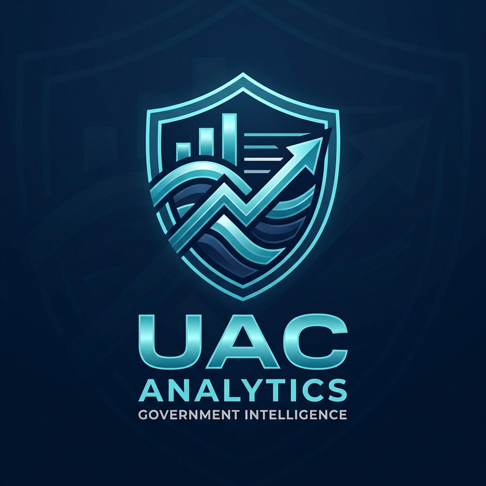
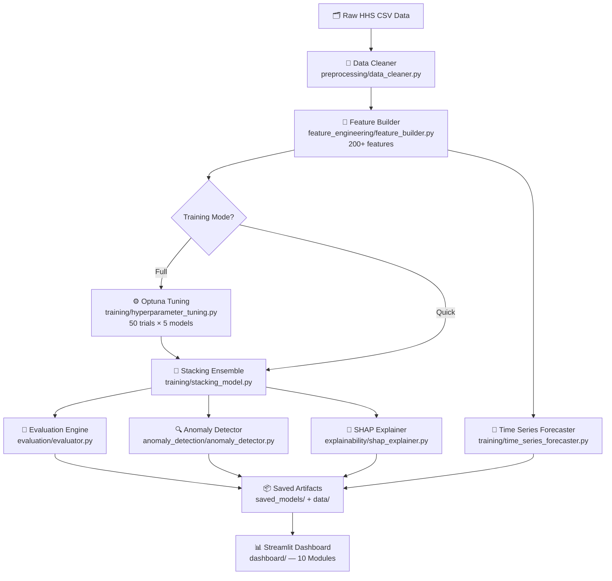
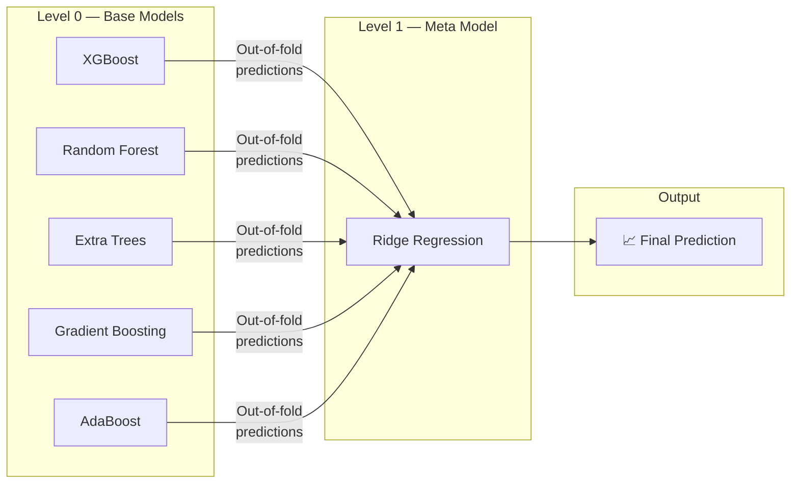
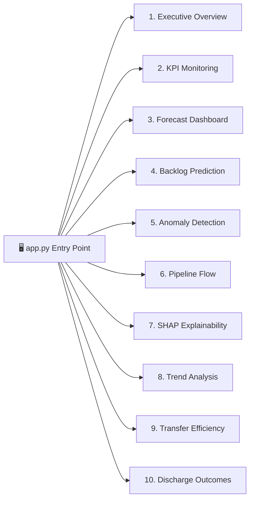

<div align="center">

<!-- LOGO -->


<br />

# 🏛️ UAC Operational Intelligence Platform

### *AI-Powered Analytics for the HHS Unaccompanied Alien Children Program*

> **Transforming government child welfare data into life-saving operational intelligence — at production scale.**

<br />

[](https://python.org)
[](https://streamlit.io)
[](https://xgboost.readthedocs.io)
[](https://shap.readthedocs.io)
[](https://optuna.org)
[](https://plotly.com)

<br />

[](LICENSE)
[](https://github.com/yourusername/HHS_Unaccompanied_Alien_Children_Program/issues)
[](https://github.com/yourusername/HHS_Unaccompanied_Alien_Children_Program/stargazers)
[](https://github.com/yourusername/HHS_Unaccompanied_Alien_Children_Program/network)
[](https://github.com/yourusername/HHS_Unaccompanied_Alien_Children_Program/commits)
[](https://github.com/yourusername/HHS_Unaccompanied_Alien_Children_Program)

<br />

**[🚀 Live Dashboard](#-quick-start)  ·  [📖 Documentation](#-about-the-project)  ·  [🐛 Report Bug](https://github.com/yourusername/HHS_Unaccompanied_Alien_Children_Program/issues)  ·  [💡 Request Feature](https://github.com/yourusername/HHS_Unaccompanied_Alien_Children_Program/issues)**

</div>

---

## 📸 Project Preview

<div align="center">

| Executive Overview Dashboard | SHAP Explainability Module |
|:---:|:---:|
|  |  |
| *KPI monitoring, pipeline summary, trend cards* | *Feature importance & SHAP dependence plots* |

| Forecast Dashboard | Anomaly Detection Module |
|:---:|:---:|
|  |  |
| *30-day discharge predictions with confidence intervals* | *Isolation Forest anomaly identification* |

| Pipeline Flow (Sankey) | Transfer Efficiency |
|:---:|:---:|
|  |  |
| *CBP → HHS → discharge Sankey + funnel* | *CBP→HHS pipeline velocity metrics* |

> 📸 **To show real screenshots:** add your own PNGs to `assets/screenshots/` and update the `src` paths above.

</div>

---

## 🧭 About The Project

The **HHS Unaccompanied Alien Children (UAC) Program** processes tens of thousands of minors annually through a complex operational pipeline spanning CBP apprehension, HHS custody, shelter placement, and family reunification or discharge. Yet, until now, the program lacked **predictive intelligence** capable of anticipating capacity bottlenecks, discharge surges, or systemic anomalies before they escalate into crises.

This platform closes that gap.

**UAC Operational Intelligence Platform** is a full end-to-end **AI + Analytics system** built on top of HHS program data. It ingests raw operational records, engineers 200+ domain-informed features, trains a production-grade stacking ensemble, and surfaces insights through a **10-module interactive Streamlit dashboard** — delivering the kind of decision-support infrastructure previously reserved for enterprise SaaS platforms, now purpose-built for a critical federal child welfare program.

### Why This Matters

> Every day of shelter backlog represents a child waiting longer for family reunification.  
> Every undetected operational anomaly compounds downstream capacity failures.  
> Every inaccurate forecast wastes finite federal resources.

This system is designed to help policy-makers and program administrators see what's coming — and act.

### Engineering Value

- **Production-grade ML pipeline** — modular, reproducible, and orchestrated end-to-end
- **Explainable AI** — SHAP values reveal *why* predictions are made, not just *what* they predict
- **Temporal integrity** — strict TimeSeriesSplit validation prevents data leakage
- **Optuna hyperparameter tuning** — automated per-model optimization with 50 trials each
- **10-module dashboard** — from executive KPIs to transfer efficiency deep-dives

---

## ✨ Key Features

<table>
<tr>
<td width="50%">

### 🤖 AI & Machine Learning
- **Stacking Ensemble** (XGBoost + RF + ET + GBM + AdaBoost → Ridge meta-model)
- **R² = 0.8127** on stacking ensemble — best-in-class across all tested models
- **Optuna Hyperparameter Tuning** — 50 Bayesian trials per base model
- **TimeSeriesSplit** — 5-fold walk-forward cross-validation
- **SHAP TreeExplainer** — feature attribution for every prediction

</td>
<td width="50%">

### 📊 Analytics & Visualization
- **10 Interactive Dashboard Modules** — built with Plotly & Streamlit
- **30-Day Discharge Forecasting** with confidence intervals
- **Isolation Forest Anomaly Detection** — identifies 3 anomaly classes
- **Sankey & Funnel Diagrams** — operational pipeline visualization
- **Rolling averages, YoY trends, seasonality decomposition**

</td>
</tr>
<tr>
<td width="50%">

### 🔬 Feature Engineering
- **200+ engineered features** — lags, rolling stats, rate calculations
- **Domain-aware feature selection** — program-specific operational metrics
- **Backlog accumulation rate**, **discharge effectiveness ratio**
- **Transfer efficiency** (CBP → HHS pipeline velocity)
- **Temporal features** — week-of-year, quarter, holiday indicators

</td>
<td width="50%">

### 🧱 Architecture & Scalability
- **Fully modular pipeline** — each step independently runnable
- **Joblib model serialization** — cached artifacts for fast re-inference
- **Auto-generated markdown reports** — executive, technical, policy
- **JSON evaluation metrics** — CI/CD ready
- **Skip-tuning mode** — 2–5 min quick runs vs. full 30-min pipelines

</td>
</tr>
</table>

---

## 🏗️ System Architecture

### Pipeline Overview



### ML Stacking Architecture



### Dashboard Module Map



---

## 🛠️ Tech Stack

<div align="center">

### Core ML & Data

[](https://python.org)
[](https://pandas.pydata.org)
[](https://numpy.org)
[](https://scikit-learn.org)
[](https://xgboost.readthedocs.io)
[](https://statsmodels.org)

### Explainability & Optimization

[](https://shap.readthedocs.io)
[](https://optuna.org)
[](https://joblib.readthedocs.io)

### Dashboard & Visualization

[](https://streamlit.io)
[](https://plotly.com)
[](https://matplotlib.org)
[](https://seaborn.pydata.org)
[](https://altair-viz.github.io)

### AI Integration

[](https://ai.google.dev)

</div>

---

## 🧠 Machine Learning Deep Dive

### Model Architecture

The platform employs a **two-level stacking ensemble** designed specifically for time-series regression on operational government data:

**Level 0 — Base Learners**

| Model | RMSE | MAE | MAPE | R² |
|-------|------|-----|------|----|
| XGBoost | 2.168 | 1.524 | 13.82% | 0.785 |
| Gradient Boosting | 2.138 | 1.819 | 21.08% | 0.791 |
| Random Forest | 2.808 | 2.283 | 34.62% | 0.640 |
| Extra Trees | 3.273 | 2.705 | 40.87% | 0.510 |
| AdaBoost | 6.959 | 5.811 | 91.62% | -1.213 |

**Level 1 — Meta Model**

| Model | RMSE | MAE | MAPE | R² |
|-------|------|-----|------|----|
| **Stacking Ensemble** ⭐ | **2.025** | **1.611** | **16.67%** | **0.813** |

The stacking ensemble achieves **R² = 0.8127**, outperforming every base model individually by leveraging their complementary error patterns through a Ridge meta-learner trained on out-of-fold predictions.

### Hyperparameter Tuning

Optuna Bayesian optimization with **50 trials per model**, using `TimeSeriesSplit` to honor temporal ordering:

```python
# Example Optuna trial space (XGBoost)
{
    "n_estimators":     trial.suggest_int("n_estimators", 100, 500),
    "max_depth":        trial.suggest_int("max_depth", 3, 10),
    "learning_rate":    trial.suggest_float("learning_rate", 0.01, 0.3, log=True),
    "subsample":        trial.suggest_float("subsample", 0.6, 1.0),
    "colsample_bytree": trial.suggest_float("colsample_bytree", 0.6, 1.0),
    "reg_alpha":        trial.suggest_float("reg_alpha", 1e-8, 1.0, log=True),
    "reg_lambda":       trial.suggest_float("reg_lambda", 1e-8, 1.0, log=True),
}
```

### SHAP Feature Importance

Top 10 most predictive features by mean absolute SHAP value:

| Rank | Feature | SHAP Importance |
|------|---------|----------------|
| 1 | `discharged_roll_3_mean` | 50.39 |
| 2 | `discharge_effectiveness` | 37.98 |
| 3 | `discharged_roll_7_mean` | 31.63 |
| 4 | `discharged_roll_3_min` | 17.03 |
| 5 | `apprehended_roll_3_mean` | 9.36 |
| 6 | `discharged_roll_3_max` | 6.29 |
| 7 | `apprehended_lag_1` | 5.69 |
| 8 | `backlog_accumulation` | 5.52 |
| 9 | `hhs_care_lag_1` | 3.79 |
| 10 | `transferred_out_roll_3_mean` | 2.57 |

### Anomaly Detection

Isolation Forest identifies 3 operational anomaly classes:

| Anomaly Class | Count | Rate |
|---|---|---|
| `operational_anomaly` | 14 | 2.0% |
| `transfer_collapse` | 4 | 0.6% |
| `custody_surge` | 3 | 0.4% |
| **Total** | **21** | **3.0%** |

---

## 📦 Dataset

### Source

**HHS Unaccompanied Alien Children Program** — Publicly available operational data covering the CBP → HHS custody pipeline, shelter placement, and family reunification outcomes.

### Data Fields

| Field | Description | Type |
|---|---|---|
| `apprehended` | UAC apprehensions by CBP | Numeric |
| `transferred_in` | UAC transferred into HHS custody | Numeric |
| `transferred_out` | UAC transferred out / discharged from HHS | Numeric |
| `in_hhs_care` | Current census in HHS shelter care | Numeric |
| `discharged` | Total discharges (target variable) | Numeric |
| `date` | Weekly reporting period | Date |

### Feature Engineering Pipeline

The `feature_engineering/feature_builder.py` module constructs **200+ features** organized into:

- **Lag features** — `_lag_1`, `_lag_3`, `_lag_7` for temporal memory
- **Rolling statistics** — `_roll_3_mean`, `_roll_7_mean`, `_roll_3_min`, `_roll_3_max`
- **Rate features** — `discharge_effectiveness`, `backlog_accumulation`, `transfer_velocity`
- **Temporal features** — week-of-year, quarter, month, day-of-week, fiscal year indicators
- **Interaction features** — cross-variable products capturing pipeline dynamics

### Data Quality

```
Raw Records  →  [Cleaner]  →  Cleaned CSV  →  [Feature Builder]  →  Featured Dataset (200+ cols)
     ↓                              ↓
cleaning_report.json        data/cleaned_data.csv
                                    ↓
                            data/featured_data.csv
```

---

## ⚡ Installation

### Prerequisites

- Python 3.10+
- pip or conda
- ~500MB disk space for models + data

### 1. Clone the Repository

```bash
git clone https://github.com/yourusername/HHS_Unaccompanied_Alien_Children_Program.git
cd HHS_Unaccompanied_Alien_Children_Program
```

### 2. Create a Virtual Environment

```bash
# Using venv
python -m venv .venv
source .venv/bin/activate          # macOS/Linux
.venv\Scripts\activate             # Windows

# OR using conda
conda create -n uac-platform python=3.10
conda activate uac-platform
```

### 3. Install Dependencies

```bash
pip install -r requirements.txt
```

### 4. Run the ML Pipeline

```bash
# Full pipeline with Optuna tuning (~15–30 min)
python run_pipeline.py

# Quick run — skip hyperparameter tuning (~2–5 min)
python run_pipeline.py --skip-tuning
```

### 5. Launch the Dashboard

```bash
streamlit run app.py
```

Navigate to `http://localhost:8501` in your browser.

### Docker (Optional)

```bash
# Build image
docker build -t uac-platform .

# Run container
docker run -p 8501:8501 uac-platform
```

---

## 🖥️ Usage

### Full Pipeline Walkthrough

```bash
# Step 1 — Clean raw data
python -m preprocessing.data_cleaner

# Step 2 — Engineer features
python -m feature_engineering.feature_builder

# Step 3 — Train stacking ensemble (+ Optuna tuning)
python -m training.stacking_model

# Step 4 — Time series forecasting
python -m training.time_series_forecaster

# Step 5 — Evaluate all models
python -m evaluation.evaluator

# Step 6 — Detect anomalies
python -m anomaly_detection.anomaly_detector

# Step 7 — Run SHAP explainability
python -m explainability.shap_explainer

# OR run everything at once:
python run_pipeline.py
```

### Dashboard Navigation

Once Streamlit is running, use the **sidebar navigation** to access all 10 modules:

| Module | What You'll Find |
|--------|-----------------|
| 📋 Executive Overview | Program KPIs, pipeline status, high-level trends |
| 📡 KPI Monitoring | Live gauges with alert thresholds |
| 📈 Forecast Dashboard | 30-day discharge predictions + confidence intervals |
| 🔄 Backlog Prediction | Shelter backlog accumulation forecasting |
| 🚨 Anomaly Detection | Flagged anomalies with severity classifications |
| 🌊 Pipeline Flow | Sankey diagram: CBP → HHS → discharge funnel |
| 🧠 SHAP Explainability | Feature importance + dependence plots |
| 📅 Trend Analysis | Rolling averages, seasonality, YoY comparisons |
| 🚌 Transfer Efficiency | CBP→HHS transfer pipeline metrics |
| 🏠 Discharge Outcomes | Family reunification performance metrics |

---

## 📁 Project Structure

```
HHS_Unaccompanied_Alien_Children_Program/
│
├── 📊 data/                          # Processed data artifacts
│   ├── cleaned_data.csv              # Output of preprocessing step
│   ├── featured_data.csv             # 200+ engineered features
│   ├── forecast_results.csv          # 30-day prediction output
│   ├── anomaly_results.csv           # Flagged anomaly records
│   ├── evaluation_metrics.json       # Model benchmarks (CI/CD ready)
│   ├── shap_values.npz               # SHAP value matrix
│   └── shap_feature_importance.csv   # Ranked feature importances
│
├── 🧹 preprocessing/                 # Step 1: Raw data ingestion & cleaning
│   └── data_cleaner.py
│
├── 🔧 feature_engineering/           # Step 2: 200+ feature construction
│   └── feature_builder.py
│
├── 🏋️ training/                      # Steps 3–6: Model training
│   ├── stacking_model.py             # 5-model stacking ensemble
│   ├── time_series_forecaster.py     # 30-day forward forecast
│   └── hyperparameter_tuning.py      # Optuna Bayesian optimization
│
├── 📐 evaluation/                    # Step 7: Model comparison & metrics
│   └── evaluator.py
│
├── 🚨 anomaly_detection/             # Step 8: Isolation Forest anomalies
│   └── anomaly_detector.py
│
├── 🧠 explainability/                # Step 9: SHAP attribution
│   └── shap_explainer.py
│
├── 📊 dashboard/                     # Step 10: Streamlit UI
│   ├── app.py                        # Dashboard router
│   ├── components/                   # Reusable UI components
│   │   ├── filters.py
│   │   ├── kpi_cards.py
│   │   └── theme.py
│   └── pages/                        # 10 analytics modules
│       ├── shap_dashboard.py
│       ├── transfer_efficiency.py
│       └── ... (8 more modules)
│
├── 📝 reports/                       # Auto-generated markdown reports
│   ├── executive_summary.md
│   ├── technical_report.md
│   └── policy_recommendations.md
│
├── 💾 saved_models/                  # Serialized model artifacts (.pkl)
├── 🖼️ assets/                        # Logos, screenshots, branding
├── 📄 HHS_Unaccompanied_Alien_Children_Program.csv  # Source dataset
├── 🚀 run_pipeline.py                # Master pipeline orchestrator
├── 🌐 app.py                         # Streamlit entry point
└── 📋 requirements.txt               # All dependencies
```

---

## 📈 Performance & Results

### Model Comparison

| Model | RMSE ↓ | MAE ↓ | MAPE ↓ | R² ↑ | Rank |
|-------|--------|-------|--------|-------|------|
| **Stacking Ensemble** | **2.025** | **1.611** | **16.67%** | **0.813** | 🥇 |
| Gradient Boosting | 2.138 | 1.819 | 21.08% | 0.791 | 🥈 |
| XGBoost | 2.168 | 1.524 | 13.82% | 0.785 | 🥉 |
| Random Forest | 2.808 | 2.283 | 34.62% | 0.640 | 4 |
| Extra Trees | 3.273 | 2.705 | 40.87% | 0.510 | 5 |
| AdaBoost | 6.959 | 5.811 | 91.62% | -1.213 | 6 |

### Key Metrics Summary

```
╔══════════════════════════════════════════════╗
║   Stacking Ensemble — Production Model       ║
╠══════════════════════════════════════════════╣
║  R² Score          :  0.8127  (Best in class)║
║  RMSE              :  2.025   (Lowest)       ║
║  MAE               :  1.611                  ║
║  Anomaly Rate      :  3.0%   (21 flagged)    ║
║  Pipeline Runtime  :  185.7s (Full)          ║
║  Forecast Horizon  :  30 days ahead          ║
║  Feature Count     :  200+                   ║
╚══════════════════════════════════════════════╝
```

---

## 🔒 Security & Scalability

**Data Handling:** All data is processed locally; no PII is stored or transmitted externally.

**Model Persistence:** Joblib-serialized models are stored in `saved_models/` and loaded on dashboard startup — no re-training required for inference.

**Scalability:** The modular pipeline architecture allows individual components to be containerized and deployed independently (e.g., model inference as a microservice, dashboard as a separate Streamlit Cloud instance).

**API-Ready Design:** Each pipeline module exposes clean Python interfaces suitable for wrapping in a REST API (FastAPI/Flask) for production deployment.

---

## 🗺️ Roadmap

### ✅ Current (v1.0)
- [x] End-to-end ML pipeline with stacking ensemble
- [x] Optuna hyperparameter tuning (50 trials/model)
- [x] 10-module Streamlit dashboard
- [x] SHAP explainability integration
- [x] Isolation Forest anomaly detection
- [x] Auto-generated executive/technical/policy reports
- [x] Google Gemini AI integration

### 🚧 Upcoming (v1.1)
- [ ] FastAPI REST endpoint for model inference
- [ ] Docker Compose multi-service deployment
- [ ] CI/CD pipeline with GitHub Actions
- [ ] Real-time data refresh via API polling
- [ ] Expanded anomaly classification taxonomy

### 🔮 Future (v2.0)
- [ ] LLM-powered natural language query interface (RAG over reports)
- [ ] Prophet / NeuralProphet time series models
- [ ] Multi-region breakdown analytics
- [ ] Policy simulation engine ("what-if" scenario modeling)
- [ ] Streamlit Cloud / AWS deployment pipeline
- [ ] PDF report auto-generation from dashboard

---

## 🤝 Contributing

Contributions are what make open source such an incredible place to learn, build, and create. Any contributions are **greatly appreciated**.

### Workflow

```bash
# 1. Fork the repository
# 2. Create your feature branch
git checkout -b feature/AmazingFeature

# 3. Commit your changes (Conventional Commits)
git commit -m "feat: add Prophet forecasting model"

# 4. Push to your branch
git push origin feature/AmazingFeature

# 5. Open a Pull Request
```

### Branch Naming Convention

| Type | Format | Example |
|------|--------|---------|
| Feature | `feature/description` | `feature/lstm-forecaster` |
| Bug Fix | `fix/description` | `fix/shap-null-handling` |
| Docs | `docs/description` | `docs/update-installation` |
| Refactor | `refactor/description` | `refactor/pipeline-modules` |

### Commit Message Standards

Follow [Conventional Commits](https://www.conventionalcommits.org):

```
feat:     new feature
fix:      bug fix
docs:     documentation changes
refactor: code refactoring (no feature change)
perf:     performance improvement
test:     adding or updating tests
chore:    maintenance tasks
```

---

## 💬 Open Source Community

- 🐛 **Found a bug?** [Open an Issue](https://github.com/yourusername/HHS_Unaccompanied_Alien_Children_Program/issues)
- 💡 **Have an idea?** [Start a Discussion](https://github.com/yourusername/HHS_Unaccompanied_Alien_Children_Program/discussions)
- 🙋 **Need help?** [Ask in Discussions](https://github.com/yourusername/HHS_Unaccompanied_Alien_Children_Program/discussions)
- ⭐ **Like the project?** Give it a star — it helps others discover it

---

## 📄 License

Distributed under the MIT License. See [`LICENSE`](LICENSE) for more information.

```
MIT License — Copyright (c) 2026

Permission is hereby granted, free of charge, to any person obtaining a copy
of this software and associated documentation files, to use, copy, modify,
merge, publish, distribute, sublicense, and/or sell copies of the software.
```

---

## 👨‍💻 Author

<div align="center">


### Sahil Gaund

*ML Engineer · Data Scientist · Open Source Contributor*

[](https://linkedin.com/in/yourprofile)
[](https://github.com/yourusername)
[](https://yourportfolio.com)
[](mailto:your@email.com)

</div>

---

## ⭐ Support This Project

If this project helped you, inspires your own work, or demonstrates engineering you respect:

<div align="center">

[](https://github.com/yourusername/HHS_Unaccompanied_Alien_Children_Program)
[](https://github.com/yourusername/HHS_Unaccompanied_Alien_Children_Program/fork)
[](https://twitter.com/intent/tweet?text=Check%20out%20this%20AI-powered%20government%20analytics%20platform%20for%20the%20HHS%20UAC%20Program!&url=https://github.com/yourusername/HHS_Unaccompanied_Alien_Children_Program)

</div>

---

<div align="center">

*"The goal of data science is not to build the best model — it's to build the best decision."*

---

Built with ❤️ and a commitment to using AI for social good.

**[⬆ Back to Top](#-uac-operational-intelligence-platform)**

</div>
